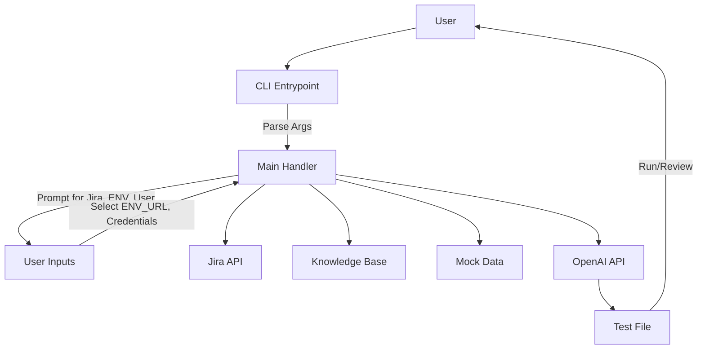
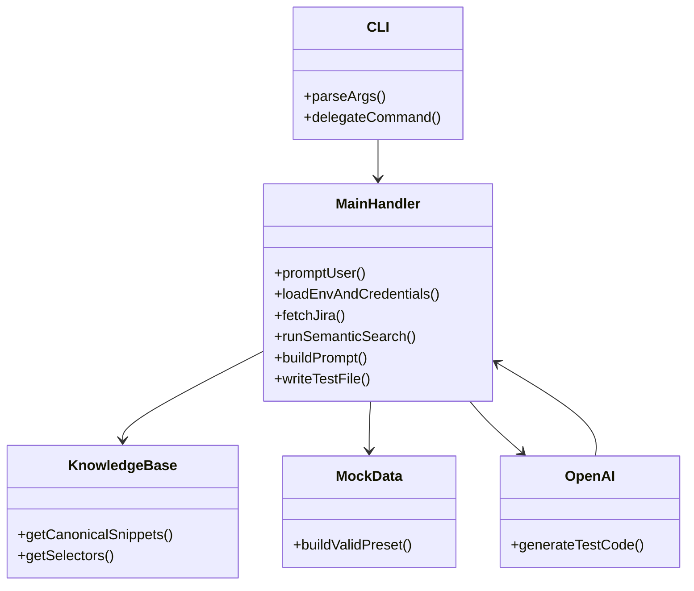
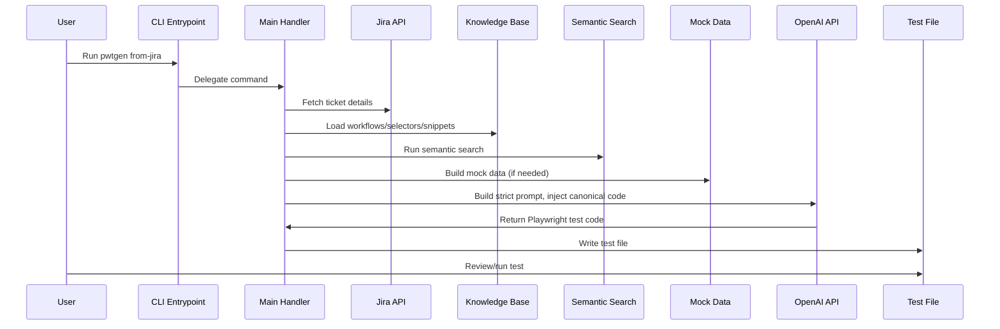

# pwtgen CLI: Deep Technical Architecture & Workflow

## 1. High-Level System Diagram

```mermaid
graph TD
    A[User] -->|Runs CLI| B[CLI Entrypoint (commander)]
    B -->|from-jira| C[Main Handler]
    B -->|record| D[Record Handler]
    C --> E[Jira API]
    C --> F[Knowledge Base]
    C --> G[Semantic Search & RAG]
    C --> H[Mock Data Builders]
    C --> I[OpenAI API]
    I --> J[Playwright Test Code]
    D --> K[Playwright Codegen]
    K --> J
    J --> L[Test File]
    L --> M[Playwright Runner]
```

---

## 1a. CLI Workflow (Expanded)



---

## 1b. Component Interaction Diagram



---

## 2. Detailed Component Breakdown

### a. CLI Entrypoint (`src/cli.ts`)
- Uses `commander` to define commands (`gen`, `from-jira`, `record`).
- Delegates to handler functions in `src/main.ts`.

### b. Main Handler (`src/main.ts`)
- Orchestrates the workflow for `from-jira` and `record` commands.
- Handles user prompts via `inquirer` (Jira ticket, environment, file path, etc.).
- Loads ENV_URLs, credentials, and mock data.
- Fetches Jira ticket details using Jira REST API.
- Runs semantic search and RAG against local knowledge base.
- Aggregates top RAG results and canonical workflows.
- Passes all context to test generation logic.

### c. Knowledge Base
- `actions.json`: Maps business actions to selectors and workflows.
- `playwrightSnippets.json`: Canonical Playwright code blocks for login, spot creation, etc.
- `article_embeddings.json`: Embeddings for semantic search.
- `loginUsers.json`: Valid login credentials for test generation.

### d. Mock Data
- `src/mock-data/`: Builder functions for valid mock data for all supported entities.
- Only the `valid` preset is used, and only if the Jira card requests that entity.

### e. Test Generation Logic (`src/openai.ts`)
- Strictly injects canonical Playwright code blocks into the OpenAI prompt.
- Interpolates ENV_URL and credentials into canonical snippets.
- Instructs OpenAI to use only the provided code blocks for login and spot creation.
- Handles additional business actions using canonical workflows/selectors from the knowledge base.
- Returns only Playwright test code (no markdown fences).

---

## 3. Data Flow Diagram



---

## 4. Prompt Construction & Canonical Snippet Injection

- After semantic search, the main handler extracts canonical Playwright code blocks for login and spot creation.
- Placeholders (`<ENV_URL>`, `<USER_EMAIL>`, `<USER_PASSWORD>`) are replaced with selected values.
- The prompt instructs OpenAI to use ONLY these code blocks for those workflows.
- Additional business actions use canonical selectors/workflows from the knowledge base.
- All ENV_URL and credentials are strictly injected from user selection and `loginUsers.json`.
- The OpenAI prompt is constructed to enforce canonical code usage and prevent generic/manual steps.

---

## 5. Mock Data Workflow

- Only the `valid` preset is used for each entity.
- Builder functions (e.g., `buildSpotData()`) return JSON objects.
- Mock data is injected into the prompt only if the Jira card requests that entity.
- All mock data is type-safe and validated before use.

---

## 6. Security & Automation

- `.env` is never committed; credentials are kept local.
- All generated tests use only real selectors, workflows, and valid data.
- `refresh-cli` script automates cleanup, build, and global link.
- Credentials and ENV_URL are never hardcoded; always selected and injected at runtime.

---

## 7. Extensibility

- New workflows/selectors can be added to the knowledge base.
- New mock data entities can be added to `src/mock-data/`.
- Canonical snippets can be updated in `playwrightSnippets.json`.
- Architecture diagrams and documentation can be expanded as needed.

---

## 8. Example: Canonical Prompt (Simplified)

```
You are an expert Playwright test author. Use ONLY the following canonical Playwright code blocks for login and spot creation. Do NOT use generic or manual steps.

Canonical Login Workflow:
<interpolated login code>

Canonical Spot Creation Workflow:
<interpolated spot creation code>

If other business actions are required, use only canonical workflows and selectors from the knowledge base. Output only the Playwright test code.
```

---

## 9. Maintenance

- All logic is TypeScript-based for type safety.
- Knowledge base and mock data are versioned and easily updatable.
- CLI can be refreshed with `npm run refresh-cli`.

---

## 10. Future Enhancements

- Add more canonical workflows and selectors.
- Integrate more advanced semantic search (e.g., hybrid RAG).
- Add support for more test types and business actions.
- Improve error handling and reporting.

---
